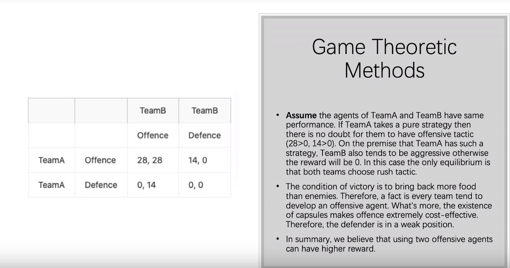
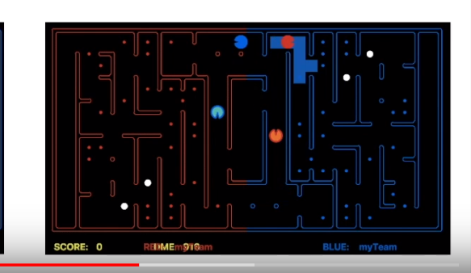

# pacman-agent

## TODO
1. Heuristic Search Algorithms (using general or pacman specific heuristic functions)
    - worth trying
2. ~~Classical Planning (PDDL and calling a classical planner, see subsection)~~
    - no need to do this, because it just give a solution not the optimal one and I also don't know how to convert current state to pddl in python currently.
    - ff can be downloaded at: https://bitbucket.org/ssardina-teaching/pacman-contest/src/master/planners/
3. Policy iteration or Value Iteration (Model-Based MDP)
    - value iteration is worse than policy iteration
        - more memory consumed
        - longer converge time
    - worth trying **only if can have function approximation instead of tabular method**
4. Monte Carlo Tree Search or UCT (Model-Free MDP)
    - worth trying
5. Reinforcement Learning ¨C classical, approximate or deep Q-learning (Model-Free MDP)
    - ~~classical~~
        - not as good as approximate in converge time
    - approximate
        - **strongly recommended to try**
    - ~~deep Q-learning~~
        - as mentioned in the lecture: 
            1. difficult to implement
            2. difficult to generate huge amount of data
6. ~~Goal Recognition techniques (to infer intentions of opponents)~~
    - lecture 6-2
    - I can't understand this. And it seems comes together with deep learning. So not gonna try it.
7. ~~Game Theoretic Methods~~
    - No idea about how this is related to this project. So not thinking about it currently.
    - minimax & alpha-beta pruning ???
    - 
        - https://www.youtube.com/watch?v=fEHBEeGk8SI ```3:33```


## possible improvement
1. [trap detection] for food in dead end, agent decide to eat it when ```2*dist_to_food <= dist_to_ghost``` in order to avoid being captured
2. when there is a food being eaten, we can use this information to infer the opponent's agent's position
3. discourage 'reverse' and 'stop' action
4. when using MCT, step size should be wisely dynamically determined (5 step because of visual range)
    - too much will cause less simulation performed
    - too little will be meaningless
    - based on https://www.youtube.com/watch?v=Sk6GqeBFrUo ```6:30``` 200 simulation/1s round for 5-depth
5. the timing to eat capsule is important
    - 
6. how to avoid agent doing stupid action back and forth (3. seems close to this idea)
7. how to detect one or two ghosts are chasing the pacman
    - because this can leads to the pacman to ```return_home``` or ```eat_capsule```
8. [agents cooperation] two agents should move in different path to cooperate instead of doing the same action 
9. [patrol defense] ghost patrol around key points to avoid pacman invade
10. [pre-label] pre-label the positions (1. seems close to this idea)
11. [smarter return] ```Return Reward Score = w * (# food carry / dist to home)```
12. [lure pacman] wait and lure the pacman into the trap when defensing
13. [change entrance (?)] when two ghosts got stuck, should our agent choose another entrance to attack?
    - I think just tie is a better choice, because the first to change can have disadvantages
14. [food density] someone mentioned, but no idea how to calculate it
15. [horizontal movement v.s. vertical movement] In defense, vertical movement won't push enemy towards its home. So it is better?
    - https://www.youtube.com/watch?v=2qDmBawHfCo
16. [collaborative defense] one ghost chase the pacman, the other one block the pacman in the other direction.

## possible features
1. number of remaining food
2. dist to closest food
3. count of next step legal action
4. dist to closest ghost
5. dist to closest pacman
6. dist to closest capsule
7. whether go back home to unpack
8. whether go back home to defense
9. dist to home
10. score

 ## coding standards
- pep8 but with 160 line length limit

## past games
1. https://people.eng.unimelb.edu.au/nlipovetzky/comp90054tournament/
2. https://sites.google.com/view/pacman-capture-hall-fame/hall-of-fame?authuser=0

## my notes
1. customize agent for team ```--delay 0.0 -r teams/team_heuristic_search/myTeam.py --redOpts=first=DummyAgent,second=DummyAgent -b teams/team_heuristic_search/myTeam.py```
2. A distanceCalculator instance caches the maze distances between each pair of positions, so your agents can use:
    ```self.distancer.getDistance(p1, p2)```

### --help
```
Usage: 
  USAGE:      python pacman.py <options>
  EXAMPLES:   (1) python capture.py
                  - starts a game with two baseline agents
              (2) python capture.py --keys0
                  - starts a two-player interactive game where the arrow keys control agent 0, and all other agents are baseline agents
              (3) python capture.py -r baselineTeam -b myTeam
                  - starts a fully automated game where the red team is a baseline team and blue team is myTeam
  

Options:
  -h, --help            show this help message and exit
  -r RED, --red=RED     Red team [Default: baselineTeam]
  -b BLUE, --blue=BLUE  Blue team [Default: baselineTeam]
  --red-name=RED_NAME   Red team name [Default: Red]
  --blue-name=BLUE_NAME
                        Blue team name [Default: Blue]
  --redOpts=REDOPTS     Options for red team (e.g. first=keys) [Default: ]
  --blueOpts=BLUEOPTS   Options for blue team (e.g. first=keys) [Default: ]
  --keys0               Make agent 0 (first red player) a keyboard agent
  --keys1               Make agent 1 (second red player) a keyboard agent
  --keys2               Make agent 2 (first blue player) a keyboard agent
  --keys3               Make agent 3 (second blue player) a keyboard agent
  -l LAYOUT_FILE, --layout=LAYOUT_FILE
                        the LAYOUT_FILE from which to load the map layout; use
                        RANDOM for a random maze; use RANDOM<seed> to use a
                        specified random seed, e.g., RANDOM23 [Default:
                        defaultCapture]
  -t, --textgraphics    Display output as text only
  -q, --quiet           Display minimal output and no graphics
  -Q, --super-quiet     Same as -q but agent output is also suppressed
  -z ZOOM, --zoom=ZOOM  Zoom in the graphics [Default: 1]
  -i TIME, --time=TIME  TIME limit of a game in moves [Default: 1200]
  -n NUMGAMES, --numGames=NUMGAMES
                        Number of games to play [Default: 1]
  -f, --fixRandomSeed   Fixes the random seed to always play the same game
  --record              Writes game histories to a file (named by the time
                        they were played)
  --recordLog           Writes game log  to a file (named by the time they
                        were played)
  --replay=REPLAY       Replays a recorded game file.
  --replayq=REPLAYQ     Replays a recorded game file without display to
                        generate result log.
  --delay-step=DELAY_STEP
                        Delay step in a play or replay. [Default: 0.03]
  -x NUMTRAINING, --numTraining=NUMTRAINING
                        How many episodes are training (suppresses output)
                        [Default: 0]
  -c, --catchExceptions
                        Catch exceptions and enforce time limits
```
